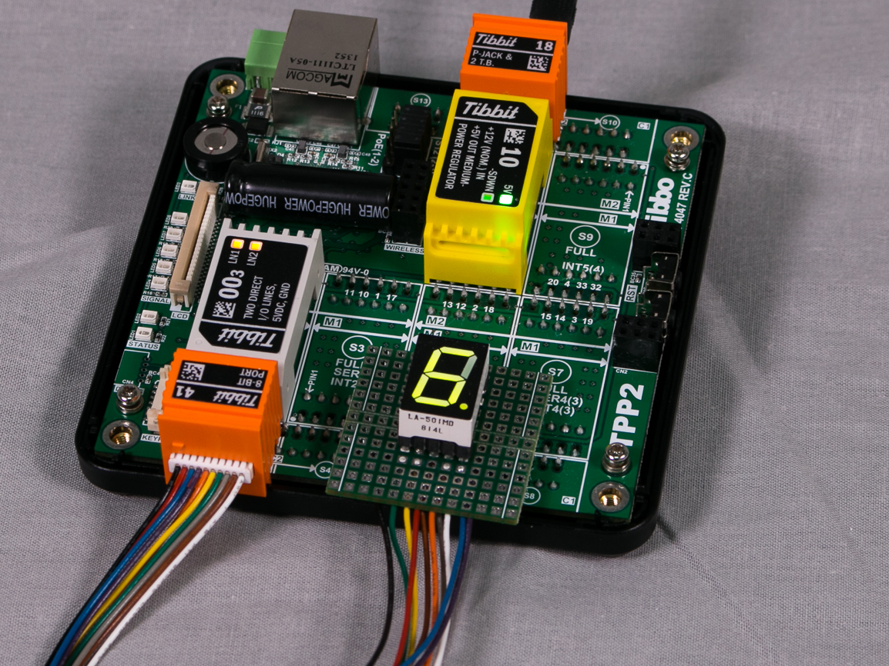

# Test Application for the 8-bit Port Extender Tibbit (#41)

You will need:

- TPP2, TPP2(G2), TPP3, or TPP3(G2) board
- One Tibbit #41 with extension cable
- One Tibbit #00-3
- Optionally, one Tibbit #9 or #10 (12V->5V regulator)
- Optionally, one Tibbit #18 (power jack)

*The last two Tibbits are necessary if you are going to power your rig from a 12V power adaptor. Alternatively you can supply regulated +5V power directly to the TPP.*

Tibbit #41 is based on the MCP23008 8-bit port extender IC from Microchip.

This Tibbo BASIC project has several test modes. The desired mode is selected in the following line of code in main.tbs:

test_item=TEST_BYTE_IN '<<================ SELECT DESIRED TEST CASE HERE

The first test mode — TEST_BIT_OUT — implements an 8-bit counter. The code uses individual IO line manipulation to read and write the state of IO lines. Use the scope to observe that line GP0 is constantly switching between LOW and HIGH states. Line GP1 switches at 1/2 of GP0 frequency. Line GP2 switches at 1/2 of GP1 frequency, and so on.

The second test mode — TEST_BYTE_OUT — implements the same counter but relies on the port-wide (byte) reads and writes.

The TEST_BYTE_IN mode implements line state tracking. The current state of eight I/O lines is printed using sys.debugprint. Obviously, you will need to run the application in the debug mode to be able to see this debug output.

Since this test enables pull-up resistors on all I/O lines, each line will read as 1 (HIGH) unless you ground it.

##### Tibbit #41 driving a 7-segment display